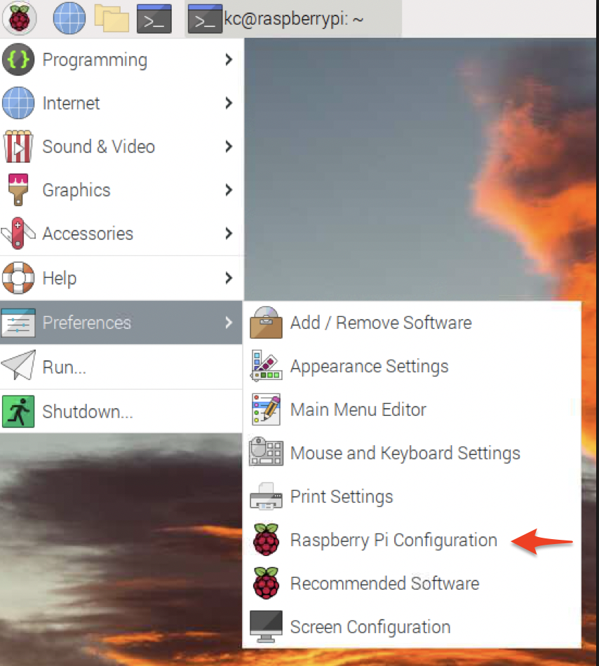
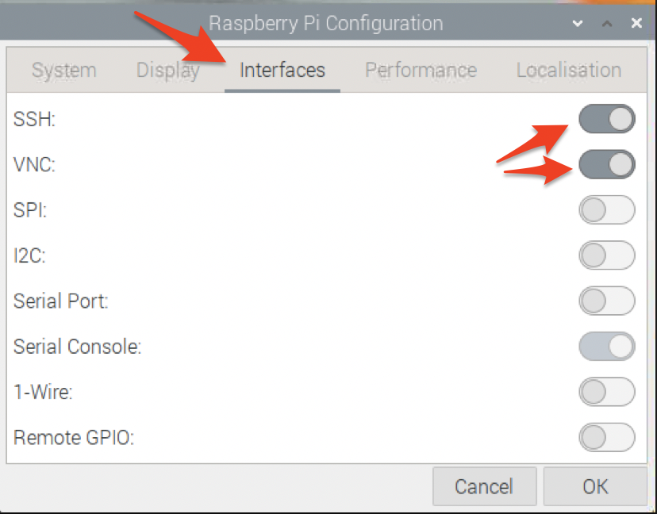
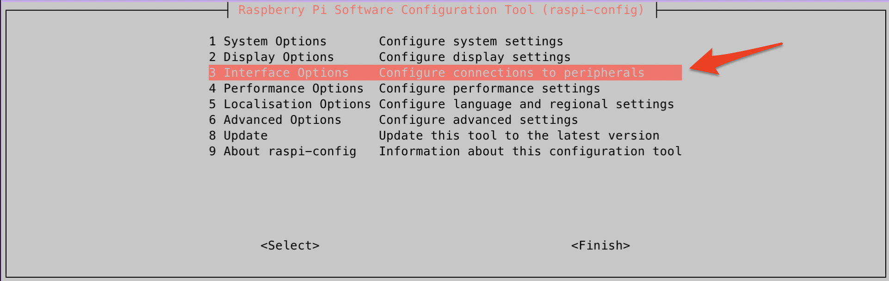
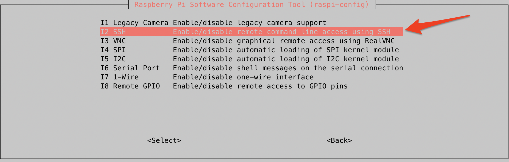
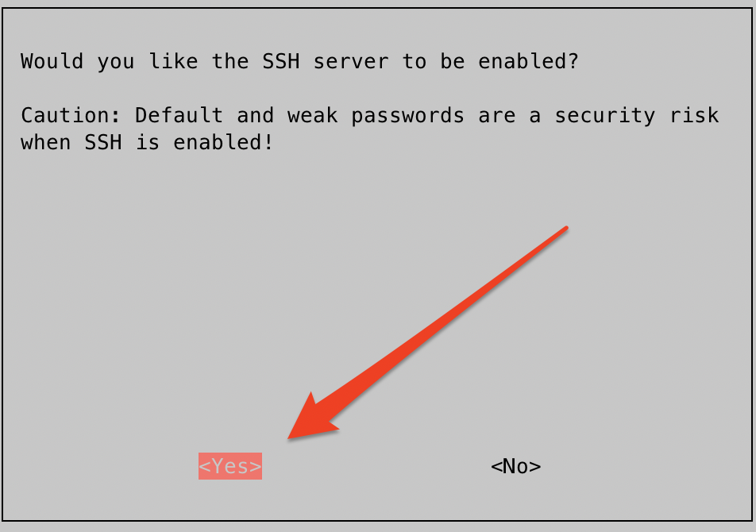

# Setting up SSH on Raspberry Pi

## Pre-requisites

Before proceeding, ensure that:

- You are using a Linux or Mac system (Windows instructions will be provided later).
- You have installed a desktop server like Raspios (Bullseye version at the time of writing) on your Raspberry Pi.
- You have completed the basic setup and connected your Raspberry Pi to the internet via WiFi or Ethernet.

## Index

- [Why Use SSH?](#why-use-ssh)
  - [Enabling SSH](#enabling-ssh)
    - [Using the GUI](#using-the-gui)
    - [Using the Command Line](#using-the-command-line)
- [First-time SSH Connection](#first-time-ssh-connection)
- [Setting Up SSH Keys](#setting-up-ssh-keys)
- [Disabling SSH Password Authentication (Optional)](#disabling-ssh-password-authentication-optional)

## Why Use SSH?

SSH (Secure Shell) allows secure remote access to your Raspberry Pi. It's especially useful if you plan to expose your Pi to the internet. SSH keys offer a more secure alternative to password-based logins.

## Enabling SSH

### Using the GUI

1. Navigate to the Raspberry Pi Configuration menu:  
   

2. Select the "Interfaces" tab and enable both SSH and VNC:  
   

### Using the Command Line

1. Open the terminal and type `sudo raspi-config` to access the Raspberry Pi configuration menu.
   

2. Navigate to "Interfacing Options" and select SSH.
   

3. Choose "Yes" to enable SSH.
   

## First-time SSH Connection

The default credentials for Raspberry Pi are:

- Username: `pi`
- Password: `raspberry`

**IMPORTANT NOTE** -> If you had changed the name or password during your Pi setup ensure use the username you selected.

To connect, use the following command:

```bash
ssh <username>@<Raspberry Pi IP address>
```

Example:

```bash
ssh pi@192.168.0.100
```

## Setting Up SSH Keys

### Generating Local SSH Keys

Follow this [GitHub guide](https://docs.github.com/en/authentication/connecting-to-github-with-ssh/generating-a-new-ssh-key-and-adding-it-to-the-ssh-agent) to generate your SSH keys. Check that they exist with:

```bash
ls ~/.ssh/
```

### Copying Your SSH Key to Raspberry Pi

Use the `ssh-copy-id` command to copy your public key to the Raspberry Pi:

```bash
ssh-copy-id <username>@<Raspberry Pi IP address>
```

Example:

```bash
ssh-copy-id pi@192.168.0.100
```

## Disabling SSH Password Authentication (Optional)

For added security, especially if your Pi will be exposed to the internet, you can disable password authentication for SSH.

1. Open the SSH configuration file:

```bash
sudo nano /etc/ssh/sshd_config
```

2. Locate and update the `PasswordAuthentication` line:

```text
PasswordAuthentication no
```

3. Save the file and restart the SSH service:

```bash
sudo /etc/init.d/ssh reload
```

Now, you should be able to SSH into your Raspberry Pi without entering a password.

---

This guide should cover all the essentials for setting up SSH on your Raspberry Pi. Feel free to reach out if you have any more questions!