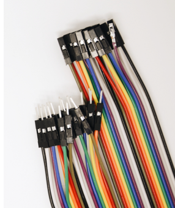
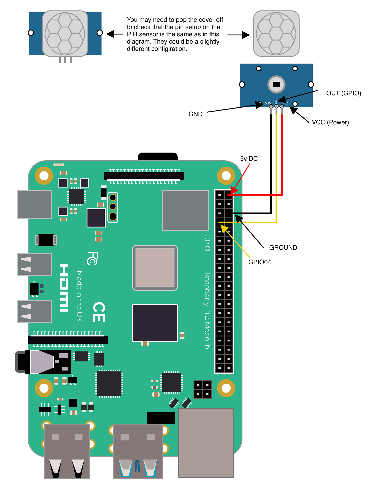

# Connecting motion sensors

Motion sensors can be extremely useful and with the right Pi project you can make a relatively inexpensive home monitoring and security systems.

## Which to buy?

I have used the PIR motion sensor from the pihut (link [here](https://thepihut.com/products/pir-motion-sensor-module)) and the Mini PIR Motion Sensor with 3 Pin Header (link [here](https://thepihut.com/products/breadboard-friendly-mini-pir-motion-sensor-with-3-pin-header)). The larger one has more configuration and scope as you would expect with the smaller one having a 3/5 meter range and a spread of about 100 degrees, which is more than enough for home systems.

## Connecting the motion sensors to your chosen Pi

None of the below diagrams highlight using a breadboard, for ease of use and practice I tend to use jumper (DuPont) wires for testing and prototyping before soldering.

### Raspberry Pi 3/4

#### Connecting the standard PIR motion sensor to a Pi 3/4

